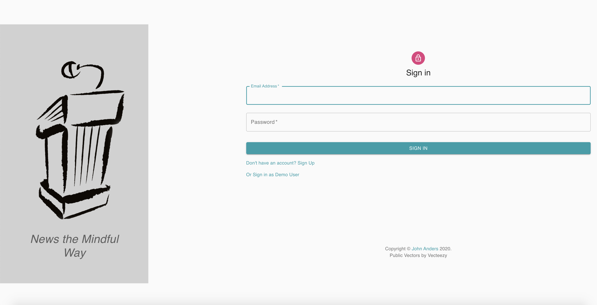
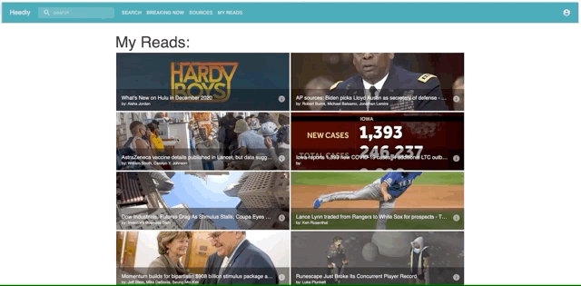

# Heedly
​
## Table of Contents
* [Technologies](#technologies)
   * [React Components](#react-components)
* [Feature List](#feature-list)
    * [Sign-Up and Login](#Auth) 
    * [Breaking News](#Breaking-News)
    * [Expand Article](#Expand-Article) 
    * [Mark Reads](#Mark-Reads) 
    * [Browse by Search & Source](#Browse) 
* [Database Schema](#database-schema)
* [Frontend Routes](#frontend-routes)
* [API Routes](#api-routes)
* [User Stories](#user-stories)
​
## <a name="technologies"></a>Technologies
- JavaScript
- React
- Express
- Redux
- HTML5 / CSS3
- Material-UI
- Sequelize
​
#### <a name ="react-components"></a>React Components
- BrowserRouter, Switch, Redirect, NavLink, from react-router-dom
- Basic hooks including useEffect, useState, useSelector, useDispatch, useHistory
- GridList/GridListTile, Paper, Icon, Popover, Typography & more from Material-UI React library
​
​

## <a name="feature-list"></a>Features

​
#### <a name="Auth"></a>Sign-up and Login
User auth was implemented using JSON Web Tokens (JWTs). The JWT is passed from the custom API built with Express and bcrypt password hashing, and the relevant info is checked on subsequent protected page loads on the front end in the Redux store. (Below is redux code for verifying user login.)
``` js 
function loadUser() {
  const authToken = Cookies.get("token");
  if (authToken) {
    try {
      //gets the value from the cookie (index 0 is key, index 1 is the value)
      const payload = authToken.split(".")[1];
      //converts base54 encoded binary string into an ASCII string
      const decodedPayload = atob(payload);
      //converts from json to JS object
      const data = JSON.parse(decodedPayload);
      //returns user as data (this will set the default state to the user)
      return data;
    } catch (e) {
      //any errors then remove the cookie
      Cookies.remove("token");
    }
  }
  //if no cookie set state to empty object
  return {};
}
```

​
#### <a name="Breaking-News"></a>Breaking News
A viewable feed of top news articles from the News API (npm 'newsapi'), using the Node News API wrapper to query.
​
#### <a name="Expand-Article"></a>Expand Article
Ability to click on item in feed to view article and a link to site of origin's original post. Expanding the full article body is limited by the paywall imposed by the News API; only a short snippet of the article loads. Nevertheless, the design of Heedly would seamlessly integrate full article reading if the paywall lowered.

The use of Redux allows for the responsive loading of articles, since the article's body is already loaded and stored before the user decides which article to expand.


​
#### <a name="Mark-Reads"></a>Mark Reads
- Ability to mark article as read or unread, and a Read page that renders a list of "read" articles. This allows users to save particularly interesting articles and come back to them at a later date.
​
#### <a name="Browse"></a>Browse by Search & Source
- Sources page lists scores of popular news sites. Clicking on a site displays the most recent articles on the selected site.
- Searchbar allows for multiple keywords and returns the most recent articles that match the provided keywords. If no search term is provided, the user is rerouted to breaking news. The search button or the "Enter" key may be used to trigger the search.
​
## <a name="database-schema"></a>Database Schema
------
1. Users
    - name
    - email
    - password hash
​
2. UserHeeds (i.e. Articles associated with user)
    - id
    - url
    - content
    - img
    - publishedAt
    - title
    - author
    - description
    - createdAt
    - updatedAt
​
3. UserMarks (joins table between User and UserHeed)
    - id
    - userId
    - userHeedId
    - createdAt
    - updatedAt
​
4. Leanings
    - id
    - politicalAffiliation
    - createdAt
    - updatedAt
​
​
## <a name="frontend-routes"></a>Frontend Routes
### /signup
-------
- Form generated with `get` request, submit will `post` name, email, password, political leaning.
- Utilize Bcrypt for user authentication & authorization (storing password hash to database).
​
### /login
------
- Form generated with `get` request, submit will `post` email & password.
- Utilize Bcrypt for user authentication & authorization.
​
### /news
------
- Table generated with `get` request, pulling articles from existing feeds.
- Clicking on article will bring you to article read page.
- Ability to mark as read.
### /expand-article
------
- View a selected article's content
​
## <a name="api-routes"></a>API Routes
### /users (GET, DELETE)
### /users/token (POST)
### /users/signup (POST)
### /users/login (PUT, POST)
​
## <a name="user-stories"></a>User Stories
------------
1. As a typical user, I want to see the news most relevant to my interests.
2. As a typical user, I want to save articles based on my interest so that I can reference them later.
3. As a politically-conscious user, I want to mindfully browse the news by source so as to compare what multiple sources are covering.
​

