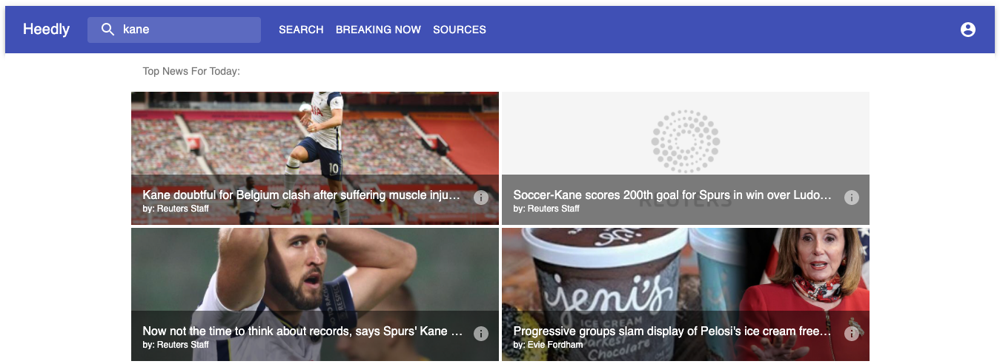
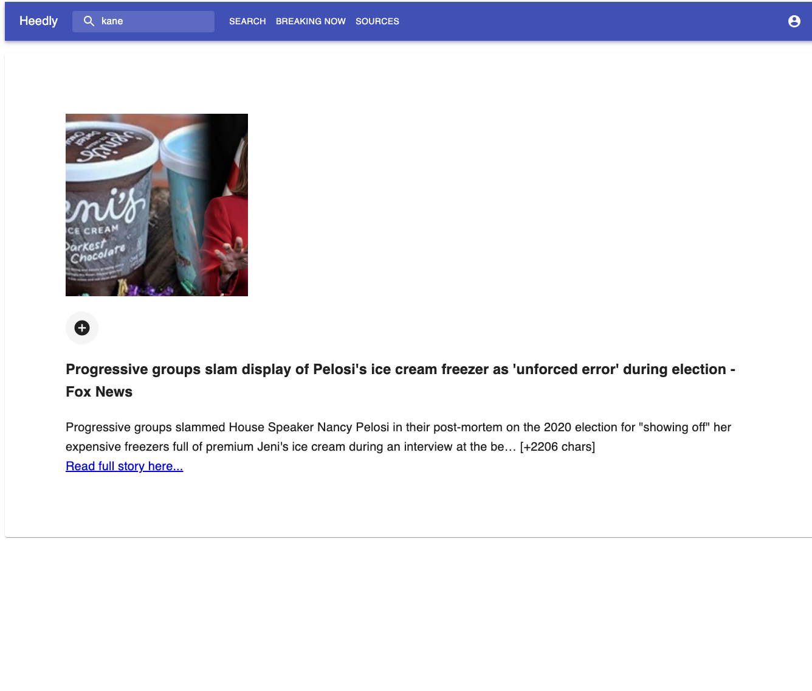

# Heedly
​
## Table of Contents
* [Technologies](#technologies)
* [User Stories](#user-stories)
* [Feature List](#feature-list)
* [React Components](#react-components)
* [Database Schema](#database-schema)
* [Frontend Routes](#frontend-routes)
* [API Routes](#api-routes)
* [Redux Tree](#redux-tree)
​
## Technologies
- JavaScript
- React
- Express
- Redux
- HTML5 / CSS3
- Material-UI
- Sequelize
​

​
## User Stories
------------
1. As a typical user, I want to see the news most relevant to my interests.
2. As a typical user, I want to save articles based on my interest so that I can reference them later.
3. As a politically-conscious user, I want to mindfully browse the news by source so as to compare what multiple sources are covering.
​
## Features - MVP
--------------
- [ ] Sign-Up page where users submit their name, email, password, and political leaning
    - [ ] Log-in page where users provide their email and password to log into the site
- [ ] A viewable feed of top news articles from the Feedly API
- [ ] Ability to click on item in feed to view article

- [ ] Ability to mark article as read or unread
    - [ ] Read page that renders a list of read articles
​
#### Stretch Features (not completed)
-------------------
- [ ] Ability to mark article as what the other side should pay most attention to and view ranking of most HEEDed articles, one per 24hrs
- [ ] Search for feeds sources
- [ ] Ability to mark article as favorite and show favorites
​
## Database Schema
------
1. Users
    - name
    - email
    - password hash
​
2. UserHeeds (i.e. Articles associated with user)
    - id
    - url
    - content
    - img
    - publishedAt
    - title
    - author
    - description
    - createdAt
    - updatedAt
​
3. UserMarks (joins table between User and UserHeed)
    - id
    - userId
    - userHeedId
    - createdAt
    - updatedAt
​
4. Leanings
    - id
    - politicalAffiliation
    - createdAt
    - updatedAt
​
​
## Frontend Routes
-------------------
### /signup
-------
- Form generated with `get` request, submit will `post` name, email, password, political leaning.
- Utilize Bcrypt for user authentication & authorization (storing password hash to database).
​
### /login
------
- Form generated with `get` request, submit will `post` email & password.
- Utilize Bcrypt for user authentication & authorization.
​
### /news
------
- Table generated with `get` request, pulling articles from existing feeds.
- Clicking on article will bring you to article read page.
- Ability to mark as read.
### /expand-article
------
- View a selected article's content
​
### Bonus (not done): Feeds selection showing sources based on genre
------------------------------------------------------
- Add to "Table of Articles" page.
​
### Bonus (not done): Ability to mark Article as Most Important of the Day 
-----------------------------------------------------------
- Users to mark an article from END of article view.
- Display ranking of most HEEDed articles
- Include on designated "Suggestion" page and/or on Events Dashboard.
